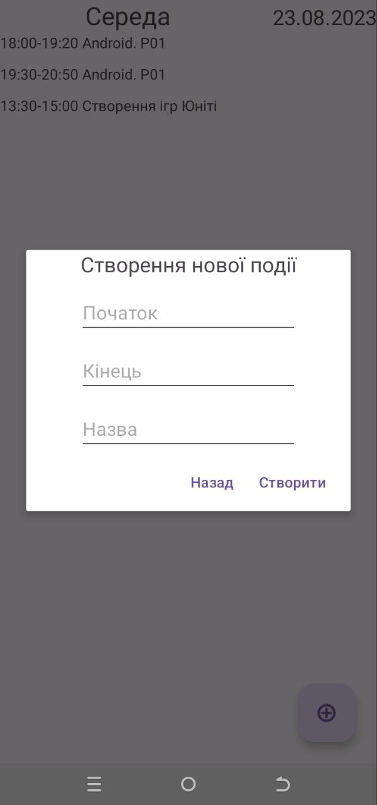

# [GB-ScheduleApp]

## Description
This is a schedule app currently in development. It allows users to manage lessons by adding new ones, navigating through days using swipe gestures, and viewing existing lessons. This project serves as a learning experience for exploring key Kotlin features and app development concepts, including:
- Fragment class and logic
- XML views, Kotlin controllers, classes, etc.
- Floating action buttons and activity dialogs
- RecyclerView elements
  
## Preview
Raw state with basic functionality that exist at a moment

